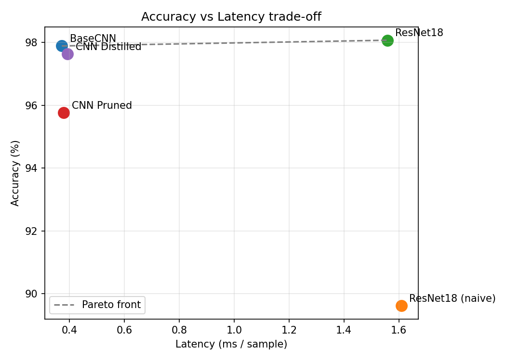
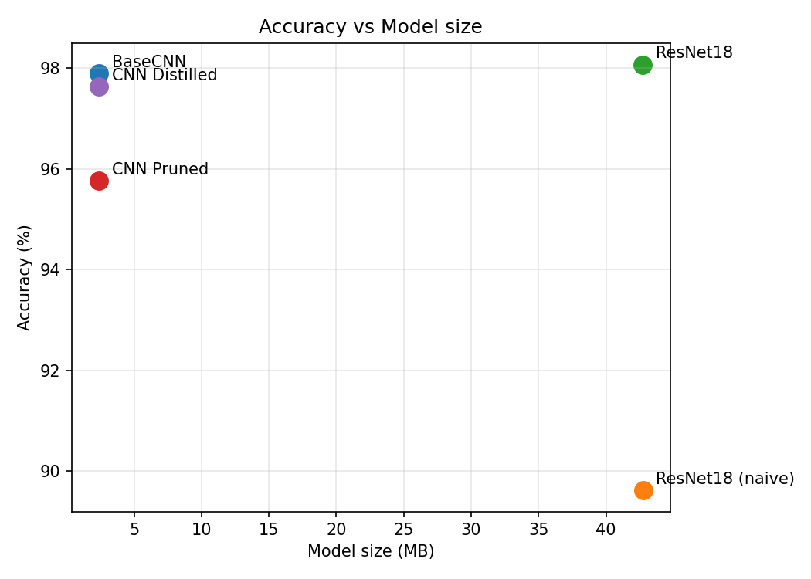
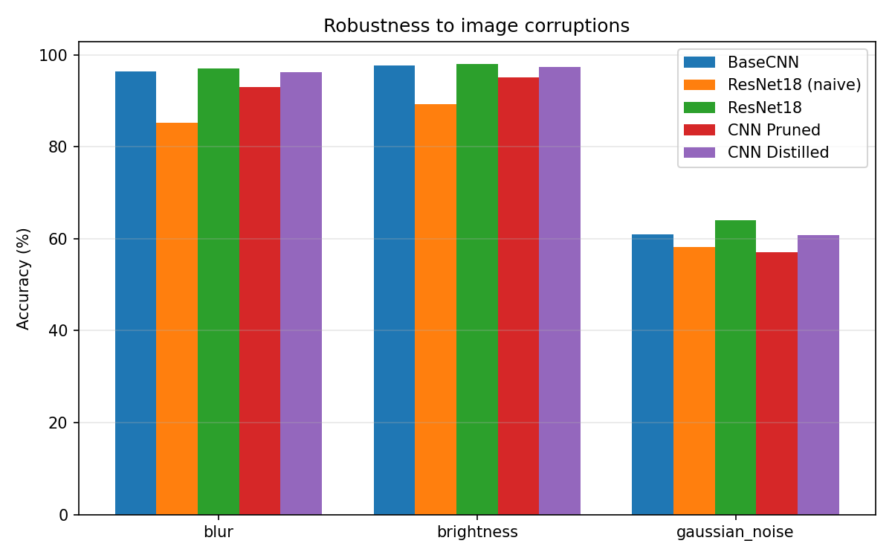
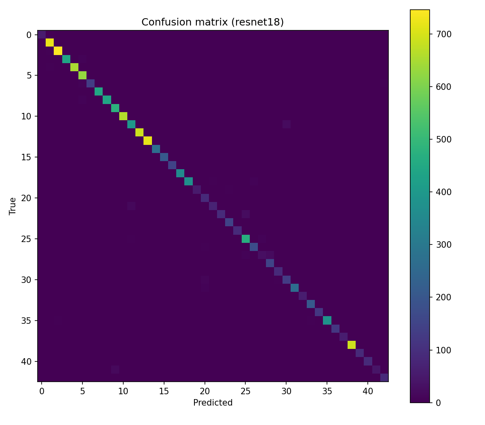

# Efficient Traffic Sign Recognition: Accuracy–Latency Trade-off

## Description
The project focuses on traffic sign classification using deep learning models trained on the GTSRB dataset. We compare a simple CNN baseline with a stronger pretrained model (ResNet18). The models are evaluated not only by classification quality, but also by inference latency, throughput, model size and robustness to simple image corruptions. As an extension we apply efficiency-oriented techniques (pruning, knowledge distillation, mixed precision, INT8 quantization) and analyze the trade-off between accuracy and performance.

This project follows the course [project guidelines](https://github.com/kaamka/dlcuda/blob/main/PROJECTS.MD).

## Models

- **BaseCNN** — three Conv→BatchNorm→ReLU→MaxPool blocks with a fully connected head (629K parameters).
- **ResNet18 (naive)** — pretrained ImageNet ResNet18 used as-is, fine-tuned on GTSRB.
- **ResNet18 (adapted)** — the same network with its 7×7 stride-2 stem and initial max-pool replaced by a 3×3 stride-1 convolution, so low-resolution 32×32 inputs are not downsampled prematurely.
- **CNN Pruned** — BaseCNN with 30% of weights zeroed by L1 unstructured pruning.
- **CNN Distilled** — BaseCNN trained from scratch with the adapted ResNet18 as a teacher (temperature 4, α=0.7).

## Results

All metrics below are measured on an NVIDIA Quadro RTX 4000. Latency is single-sample (batch size 1) inference, averaged over 200 runs after 50 warm-up runs. Throughput is measured end-to-end over the test set (includes data loading).

| Model | Accuracy | Latency | Throughput | Size | Params |
|-------|----------|---------|------------|------|--------|
| ResNet18 (adapted) | **98.07%** | 1.558 ms | 4795 /s | 42.73 MB | 11.19 M |
| BaseCNN | 97.89% | **0.372 ms** | **5205 /s** | **2.40 MB** | **0.63 M** |
| CNN Distilled | 97.63% | 0.392 ms | 5135 /s | 2.40 MB | 0.63 M |
| CNN Pruned | 95.76% | 0.379 ms | 4720 /s | 2.40 MB | 0.63 M |
| ResNet18 (naive) | 89.62% | 1.609 ms | 4904 /s | 42.76 MB | 11.20 M |





The Pareto front contains only two models: the adapted ResNet18 (highest accuracy) and BaseCNN (lowest latency). Every other variant is dominated.

## Analysis

### Adapting the stem matters more than model capacity
The naive ResNet18 reaches only 89.62%, while the adapted version reaches 98.07% — a **+8.45 pp** gain from a single architectural change. ResNet18 was designed for 224×224 ImageNet images: its 7×7 stride-2 convolution followed by a 3×3 stride-2 max-pool reduces a 32×32 input to 8×8 before any real feature extraction happens. Replacing the stem with a 3×3 stride-1 convolution and removing the max-pool keeps the spatial resolution high through the early layers. This is the most important result of the project: the "weak pretrained model" is an artifact of input-resolution mismatch, not of capacity.

### BaseCNN is the efficiency winner
The adapted ResNet18 wins on accuracy, but only by 0.18 pp over BaseCNN. For that margin it pays **4.2× higher latency** (1.558 vs 0.372 ms), **18× more parameters**, and **18× more disk** (42.7 vs 2.4 MB). For any deployment where latency, memory or energy matter, BaseCNN is the better choice on this task.

### Knowledge distillation: ResNet accuracy in a CNN footprint
The distilled CNN reaches 97.63% — within 0.26 pp of the baseline CNN and 0.44 pp of the teacher — while keeping the 2.4 MB / 0.37 ms profile of BaseCNN. Distillation is the most attractive efficiency technique here: it transfers the teacher's knowledge at no size or latency cost.

### Pruning: accuracy cost, no speedup
L1 unstructured pruning of 30% of the weights drops accuracy to 95.76% (−2.13 pp) with no change in latency or file size. This is expected: zeroing individual weights does not change tensor shapes, so dense kernels run identically. Real gains would require structured/channel pruning or quantization.

### Mixed precision (FP16): not always faster
On this GPU, FP16 inference of ResNet18 is **slower** than FP32 (1.863 ms vs 1.535 ms). The Quadro RTX 4000 (Turing) has FP16 tensor cores, but at batch size 1 with a small spatial resolution and many BatchNorm layers, the conversion overhead is not amortized and tensor cores are underused. Mixed precision pays off for large batches and larger models, not for this single-sample, low-resolution workload.

### INT8 quantization (CPU): best size/accuracy result
Post-training static quantization (FX graph mode, fbgemm) of BaseCNN, evaluated on CPU:

| Model | Accuracy | Latency (CPU) | Size |
|-------|----------|---------------|------|
| BaseCNN FP32 | 97.89% | 0.328 ms | 2.41 MB |
| BaseCNN INT8 | 97.89% | 0.269 ms | 0.62 MB |

INT8 gives a **3.89× smaller** model and **1.22× faster** CPU inference with **no accuracy loss** — by far the best efficiency technique tested, and the most relevant for edge/CPU deployment.

### Robustness to image corruptions
Accuracy under three corruptions applied at inference time (Gaussian noise, blur, brightness shift, applied in pixel space):



Gaussian noise is by far the hardest corruption (57–64% across models), while blur and brightness shifts are tolerated well (85–98%). The adapted ResNet18 is the most robust on every corruption; the pruned CNN is the least robust, consistent with its lower clean accuracy. BaseCNN and the distilled CNN behave almost identically.

### Per-class behaviour


The confusion matrix is essentially diagonal: errors are sparse and concentrated in a few visually similar classes. The per-class confusion matrix for BaseCNN (`figures/confusion_cnn.png`) shows the same pattern.

## Conclusions
- The accuracy gap between the simple CNN and the pretrained ResNet is almost entirely explained by the input-resolution-aware stem, not by capacity.
- At 32×32, a 0.63 M-parameter CNN matches an 11 M-parameter ResNet within 0.2 pp while being ~4× faster and ~18× smaller.
- Among efficiency techniques, **INT8 quantization** (3.9× smaller, no accuracy loss) and **knowledge distillation** (teacher accuracy, baseline footprint) are clear wins; pruning and FP16 give no benefit in this setting.

## Reproducing the results

### Setup
```bash
pip install -r requirements.txt
```
A CUDA-capable GPU is recommended; training falls back to CPU but is slow. GTSRB is downloaded automatically on the first run into the `--data` directory.

### Training and evaluation
```bash
python main.py --data ./data --epochs-cnn 30 --epochs-resnet 20
```
Trains all model variants, saves weights to `*.pt`, and writes metrics to `results.json`.

| Flag | Default | Description |
|------|---------|-------------|
| `--data` | `./data` | dataset location |
| `--epochs-cnn` / `--epochs-resnet` / `--epochs-distill` | 30 / 20 / 25 | epochs per stage |
| `--batch-size` | 128 | batch size |
| `--lr` | 1e-3 | base learning rate |
| `--no-amp` | off | disable automatic mixed precision |
| `--prune-amount` | 0.3 | fraction of weights pruned |
| `--seed` | 42 | random seed |
| `--output` | `results.json` | metrics output path |

### Figures
```bash
python plots.py
python plots.py --confusion resnet18.pt --arch resnet18 --data ./data
```
Writes the Pareto, robustness, accuracy-vs-size and confusion-matrix figures to `figures/`.

### INT8 quantization
```bash
python quantize.py --data ./data
```
Quantizes `cnn.pt` to INT8 (CPU), benchmarks it against FP32 and writes `results_int8.json`.

## Project structure

| File | Description |
|------|-------------|
| `models.py` | `BaseCNN` and `ResNet18` (naive and 32×32-adapted stems) |
| `data.py` | GTSRB loaders, training augmentations, image corruptions |
| `eval_utils.py` | accuracy, latency, throughput, robustness, full report |
| `distill.py` | knowledge distillation loss and training step |
| `main.py` | trains all variants and writes `results.json` |
| `plots.py` | figures from `results.json` (+ confusion matrices) |
| `quantize.py` | INT8 post-training quantization benchmark |

## Hardware and reproducibility
Results were produced on an NVIDIA Quadro RTX 4000 (8 GB) with PyTorch 2.0.1 + CUDA 11.7. Training uses a fixed seed (`--seed 42`); small run-to-run variation from non-deterministic CUDA kernels is expected.
